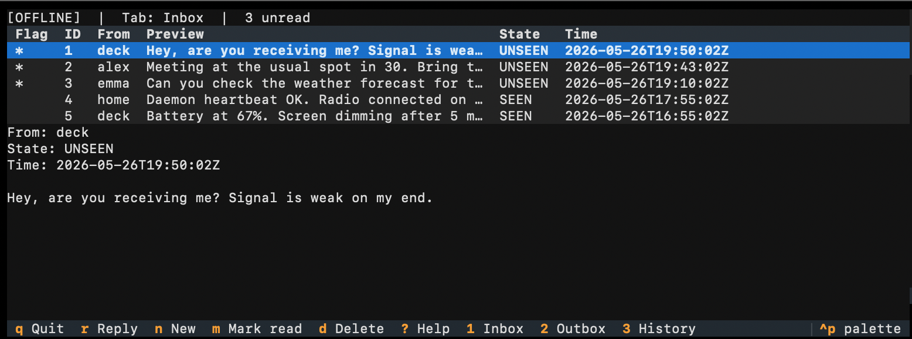

# meshtad

A simple meshtastic messenger for your cyberdeck, linux machine or mac.

Meshtastic store-and-forward daemon `meshtad` has two thin clients:
- `meshcli`, the command line interface (CLI) for one-shot commands
- `meshtui`, the terminal user interface (TUI)




## Architecture

```
┌─────────┐  ┌─────────┐  ┌─────────┐
│ meshcli │  │ TUI     │  │ Web UI  │
│ (CLI)   │  │         │  │ (future)│
└────┬────┘  └────┬────┘  └────┬────┘
     │            │            │
     └────────────┼────────────┘
                  ▼
         ┌─────────────────┐
         │   SQLite (WAL)  │   ← shared interface, no sockets
         │  ~/.local/...   │
         └────────┬────────┘
                  ▼
         ┌─────────────────┐
         │   meshtad       │   RX thread  (pubsub)
         │   daemon        │   TX thread  (drain outbox)
         │                 │   Scheduler  (timeouts, cleanup)
         └────────┬────────┘
                  ▼
         ┌─────────────────┐
         │ SerialInterface │   (auto-detect or --port)
         │  (Meshtastic)   │
         └─────────────────┘
```

Outgoing and incoming messages to and from the net are stored in an SQLite database. 

The daemon in the background manages 
- Sending messages on the mesh, including retries and failures.
- Persistant state logging to your database for each message. 
- Receiving and storing incomming messages, so you can consume them whenever you want, even after a reboot.

The clients let you
- Draft messages and put them in the outbox, where the daemon sends them, and handles failed sends (no connection to target, etc) gracefully.
- Read messages from the inbox, where the daemon put them
- Delete messages from inbox and outbox
- See your message history

## Message states

**Inbound:**  UNSEEN → SEEN → DELETED
**Outbound:** QUEUED → SENT → ACKED | FAILED → DELETED

## Install

```bash
cd /workspace/meshtad
pip install -e .
```

## Run the daemon

```bash
meshtad                                       # auto-detect serial port
meshtad --port /dev/cu.usbmodem1234
meshtad --config /path/to/config.toml         # default: ~/.config/meshtad/config.toml
meshtad --db /path/to/meshtad.db              # default: ~/.local/share/meshtad/meshtad.db
```

Or:

```bash
python -m meshtad
```

## meshcli commands

```bash
meshcli send homenode "hello world"        # fire-and-forget
meshcli inbox                              # list inbound
meshcli inbox --unseen-only
meshcli read 42                            # mark SEEN, print body
meshcli delete 42                          # soft delete
meshcli history --with homenode --limit 20
meshcli outbox                             # queued/SENT/FAILED
meshcli status 42                          # send status
meshcli alias '!aabbccdd' homenode         # register alias
meshcli aliases                            # list known senders
meshcli dongle-detect                      # find serial ports
meshcli dongle-eject                       # request daemon release
meshcli db-status                          # DB size + counts
meshcli vacuum                             # compact DB
```

## Config (TOML, optional)

`~/.config/meshtad/config.toml`:

```toml
[meshtad]
log_level = "INFO"
redact_bodies = true                  # log "<N chars redacted>" instead of bodies
serial_port = "/dev/cu.usbmodem1234"  # omit for auto-detect
max_retries = 5
retry_initial_s = 5.0                 # first backoff delay
retry_max_s = 300.0                   # backoff ceiling
retry_base = 2.0                      # exponential base
ack_timeout_s = 30.0
size_warning_enabled = true
size_warning_mb = 100

[auto_delete]
# global_s = 86400                    # delete SEEN/sent msgs this many seconds later; omit = never

[tui]
poll_interval_s = 2.0
theme = "dark"
```

Every key is optional; omitted keys keep their defaults. The database path is **not** a config key — it defaults to `~/.local/share/meshtad/meshtad.db` and is overridden with the `--db` flag. The config file is reloaded automatically when its mtime changes, so edits take effect without restarting the daemon.
